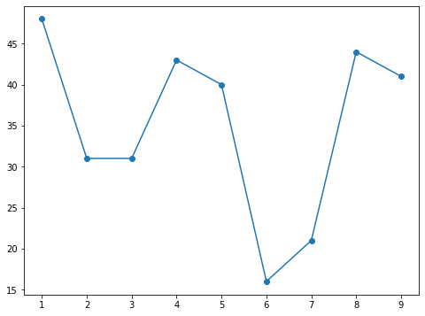

# Python Basics
Most of these notes are built in Jupyter Notebook. So let's do a quick review of how to install Jupyter Notebook first. 

Jupyter Notebook is an open source web application that allows us to create and share code and documents. It is an interactive computing environment, which allows users to experiment with code and share it.


Take a close look from their web page: https://jupyter.org/

Jupyter is the acronym for Julia, Python and R, the three programming languages Jupyter started with, although today it supports a large number of languages.
It is widely used to create and share documents containing code. This is very useful in teaching, since we can show with examples how a script, a language works or ask students to propose and validate their own code.

## Advantages of using Jupyter Notebook

Provides an environment where you can log code, execute code, view results, visualize data, and view output results. These features make it a convenient tool for performing end-to-end data science workflows, which can be used for data cleansing, statistical modeling, creating and training machine learning models, data visualization, and many other purposes. When you are still prototyping a project, Jupyter Notebooks is really useful, because your code is written in a separate unit and runs separately. This allows users to test specific code blocks in the project without having to run the code from the beginning of the script. Jupyter Notebook is a web application that facilitates the creation and sharing of literary program documents. It supports real-time code, mathematical equations, visualization and Markdown. Its uses include data cleaning and conversion, numerical simulation, statistical modeling and machines. Studying and so on. Currently, the data in Kaggle, the most popular data mining competition, is in Jupyter format. For machine learning beginners, learning to use Jupyter Notebook is very important.

## Jupyter Notebook vs Jupyter Lab

Jupyter Notebook is an interactive web-based computational environment for creating Jupyter notebook documents. It supports several languages such as Python (IPython), Julia, R, etc. and is mainly used for data analysis, data visualization and more interactive exploratory computing. JupyterLab is the next generation user interface including laptops. It has a modular structure, where you can open multiple notebooks or files (e.g. HTML, text, Markdowns, etc.) as tabs in the same window. It offers a more IDE-like experience. For a beginner, it is advisable to start with Jupyter Notebook, as it only consists of a file explorer and an editor (notebook) view. It might be easier to use. If you want more features, switch to JupyterLab. JupyterLab offers many more features and an improved interface, which can be extended through extensions.

To install Jupyter Notebook, please keep forward the next link: https://docs.jupyter.org/en/latest/install/notebook-classic.html

Once JupyterLab is installed in our computer we can make use of it and exploit all the possibilities to write code and visualize at the same time what we are doing. It is a good starting point. Usually what I do is that I start writing code in JupyterLab and then, if necessary, I convert this notebook into a Python executable for speed and versatility.

In data science, usually, we use libraries or write code to download, extract, consolidate, organize, optimize, analyze and visualize data and data manipulation results.  Let's start then with some basic notions and syntax of how to use Python for our purposes and also in general tasks. Python provides a good foundation for all our data science tasks.

**_Let's do it!_**

## What is Python?

Python is a popular programming language. It was created by Guido van Rossum, and released in 1991.

It is used for:
- web development (server-side),
- software development,
- mathematics,
- system scripting.

## What can Python do?
- Python can be used on a server to create web applications.
- Python can be used alongside software to create workflows.
- Python can connect to database systems. It can also read and modify files.
- Python can be used to handle big data and perform complex mathematics.
- Python can be used for rapid prototyping, or for production-ready software development.

## Why Python?
- Python works on different platforms (Windows, Mac, Linux, Raspberry Pi, etc).
- Python has a simple syntax similar to the English language.
- Python has syntax that allows developers to write programs with fewer lines than some other programming languages.
- Python runs on an interpreter system, meaning that code can be executed as soon as it is written. This means that prototyping can be very quick.
- Python can be treated in a procedural way, an object-oriented way or a functional way.


Python syntax can be executed by writing directly in the Command Line:


```python
## Example: Try out yourself your first task, print "Hello, World!"
print("Hello, World!")
```

    Hello, World!


## Creating a Comment
Comments starts with a #, and Python will ignore them: 


```python
#This is a comment
print("Hello, World!")
```

    Hello, World!


Comments can be placed at the end of a line, and Python will ignore the rest of the line:


```python
print("Hello, World!") #This is a comment
```

    Hello, World!


A comment does not have to be text that explains the code, it can also be used to prevent Python from executing code:


```python
#print("Hello, World!")
print("Cheers, Beer!") 
```

    Cheers, Beer!


```python

```


```python

```


```python

```


```python

```


```python

```


```python

```


```python

```


```python

```


```python

```


```python

```


```python

```


```python
import numpy as np
import matplotlib.pyplot as plt
```


```python
x=np.arange(1,10,1)
```


```python
y=np.random.randint(13,50,len(x))
```


```python
plt.figure(figsize=(8,6))
plt.plot(x,y,marker='o')
plt.show()
```





```python

```


```python

```
