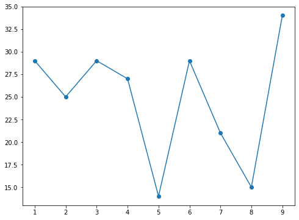

## This is the first notebook...


```python
import numpy as np
import matplotlib.pyplot as plt
```


```python
x=np.arange(1,10,1)
```


```python
y=np.random.randint(13,50,len(x))
```


```python
plt.figure(figsize=(8,6))
plt.plot(x,y,marker='o')
plt.show()
```





```python

```


```python

```
